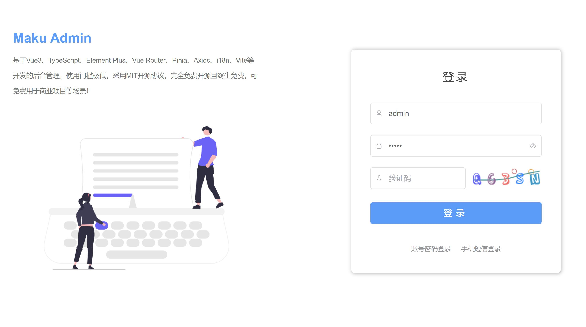
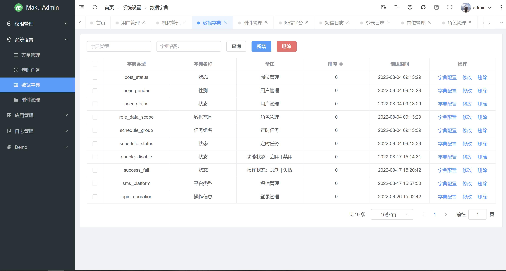
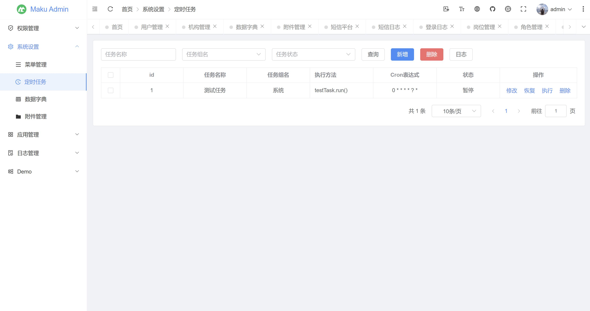
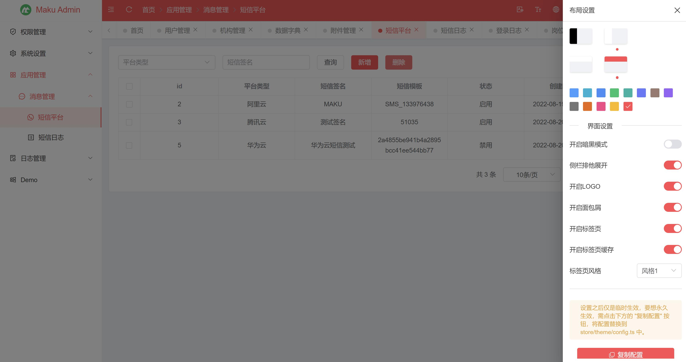

## 介绍
- 基于Vue3、TypeScript、Element Plus、Vue Router、Pinia、Axios、i18n、Vite等开发的后台管理，使用门槛极低。
- 目前已实现maku-admin后端接口的有：【maku-boot】 和 【maku-cloud】 2个后端开源项目。
- 开发文档：https://maku.net/docs/maku-admin
- 官网地址：https://maku.net

## maku-boot | 单体低代码开发平台
- Gitee仓库：https://gitee.com/makunet/maku-boot
- Github仓库：https://github.com/makunet/maku-boot
- 演示环境：https://demo.maku.net


## maku-cloud | 微服务低代码开发平台
- Gitee仓库：https://gitee.com/makunet/maku-cloud
- Github仓库：https://github.com/makunet/maku-cloud
- 演示环境：https://demo.maku.net/maku-cloud


## 安装
注意：需使用 nodejs 长期维护版本，如：[20.x、22.x]，能保证项目的稳定运行。

```bash
# 克隆项目
git clone https://gitee.com/makunet/maku-admin.git

# 进入项目
cd maku-admin

# 安装依赖
npm install

# 运行项目
npm run dev

# 打包发布
npm run build
```


## 微信交流群
为了更好的交流，我们新提供了微信交流群，需扫描下面的二维码，关注公众号，回复【加群】，根据提示信息，作者会拉你进群的，感谢配合！


## 开源汇总
- 低代码开发平台（单体版）：https://gitee.com/makunet/maku-boot
- 低代码开发平台（微服务）：https://gitee.com/makunet/maku-cloud
- 超好用的代码生成器：https://gitee.com/makunet/maku-generator
- Vue3.x 后台管理UI：https://gitee.com/makunet/maku-admin
- Vue3.x 表单设计器：https://gitee.com/makunet/maku-form-design


## 支持
如果觉得框架还不错，或者已经在使用了，希望你可以去 [Github](https://github.com/makunet/maku-admin) 或 [Gitee](https://gitee.com/makunet/maku-admin) 帮作者点个 ⭐ Star，这将是对作者极大的鼓励与支持。

## 效果图 









## 版权说明
- MAKU生态技术框架全系列版本遵循Apache License 2.0开源协议。
- 允许个人项目、承接私活及企业内部项目使用，可享有终身免费许可。
- 禁止任何针对开源项目或产品销售的二次开发行为，未经授权的行为将视为侵权。
- 请尊重知识产权，不允许删除源码注释申明及作者信息，违者将追究法律责任。
